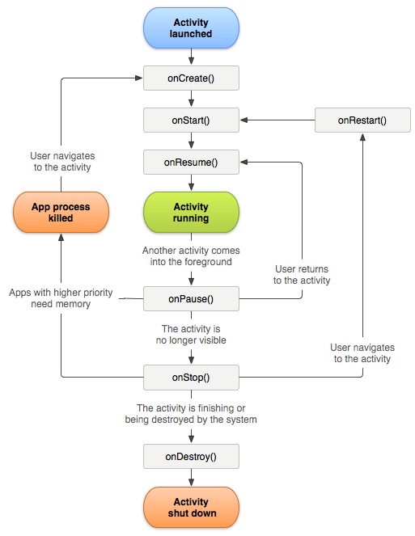

# Track app crashes

This information helps you understand how crashes are tracked and the best practices to handle false crashes.

> **Tip:** App crashes are tracked as part of lifecycle metrics. Before you can track crashes, add the library to your project and implement lifecycle. For more information, see *Add the SDK and Config File to your IntelliJ IDEA or Eclipse Project* in [Core implementation and lifecycle](/docs/android/getting-started/dev-qs.md).

When lifecycle metrics are implemented, a call is made to `Config.collectLifecycleData` in the `OnResume` method of each activity. In the `onPause` method, a call is made to `Config.pauseCollectingLifeCycleData`.

In the `pauseCollectingLifeCycleData`, a flag is set to indicate a graceful exit. When the app is launched again or resumed, `collectLifecycleData` checks this flag. If the app did not exit successfully as determined by the flag status, an `a.CrashEvent` context data is sent with the next call and a crash event is reported.

To ensure accurate crash reporting, you must call `pauseCollectingLifeCycleData` in the `onPause` method of each activity. To understand why this is essential, here is an illustration of the Android activity lifecycle: 



For more information about the Android activity lifecycle, see [Activities](https://developer.android.com/guide/components/activities.html).

*This Android lifecycle illustration was created and [shared by the Android Open Source Project](https://source.android.com/) and used according to terms in the [Creative Commons 2.5 Attribution License](https://creativecommons.org/licenses/by/2.5/).*

## What can cause a false crash to be reported?

1. If you are debugging by using an IDE, such as Android Studio, and launching the app again from the IDE while the app is in the foreground causes a crash.

   > **Tip:** You can avoid this crash by backgrounding the app before launching again from the IDE.

1. If the last foreground Activity of your app is backgrounded and does not call `Config.pauseCollectingLifecycleData();` in `onPause`, and your app is manually closed or killed by the OS, the next launch results in a crash.

## How should Fragments be handled?

Fragments have application lifecycle events that are similar to Activities. However, a Fragment cannot be active without being attached to an Activity.

> **Important:** You need to rely on the lifecycle events against which the containing activities can run your code. This will be handled by the parent view of the Fragment.

## (Optional) Implement activity lifecycle callbacks

Starting with API Level 14, Android allows global lifecycle callbacks for activities. For more information, see [Application](https://developer.android.com/reference/android/app/Application).

You can use these callbacks to ensure that all of your Activities correctly call `collectLifecycleData()` and `pauseCollectingLifecycleData()`. You need to add this code only in your main Activity and any other Activity in which your app may be launched:

```js
import com.adobe.mobile.Config; 
  
public class MainActivity extends Activity { 
... 
    @Override 
    protected void onCreate(Bundle savedInstanceState) { 
        super.onCreate(savedInstanceState); 
        setContentView(R.layout.activity_main); 
  
        getApplication().registerActivityLifecycleCallbacks(new Application.ActivityLifecycleCallbacks() { 
            @Override 
            public void onActivityResumed(Activity activity) { 
                Config.setContext(activity.getApplicationContext()); 
                Config.collectLifecycleData(activity); 
            } 
  
            @Override 
            public void onActivityPaused(Activity activity) {     
                Config.pauseCollectingLifecycleData(); 
            } 
    
            // the following methods aren't needed for our lifecycle purposes, but are required to be implemented 
            // by the ActivityLifecycleCallbacks object 
            @Override 
            public void onActivityCreated(Activity activity, Bundle savedInstanceState) {} 
            @Override 
            public void onActivityStarted(Activity activity) {} 
            @Override 
            public void onActivityStopped(Activity activity) {} 
            @Override 
            public void onActivitySaveInstanceState(Activity activity, Bundle outState) {} 
            @Override 
            public void onActivityDestroyed(Activity activity) {} 
        }); 
    } 
... 
}
```

To send additional context data with your lifecycle call by using `Config.collectLifecycleData(Activity activity`, `Map<String`, `Object> contextData)`, you must override the `onResume` method for that Activity and ensure that you call `super.onResume()` after manually calling `collectLifecycleData`.

```js
@Override 
protected void onResume() { 
    HashMap<String, Object> cdata = new HashMap<>(); 
    cdata.put("someKey", "someValue"); 
    Config.collectLifecycleData(this, cdata); 
  
    super.onResume(); 
}
```
