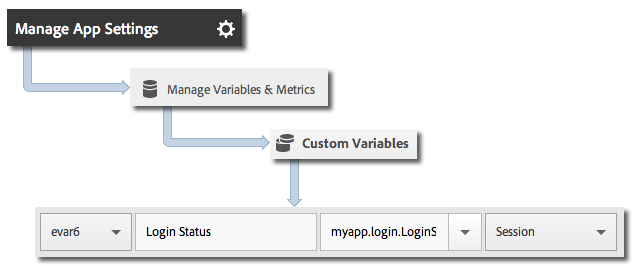

# Track app states

States are the different screens or views in your application.

Each time a new state is displayed in your application, for example, when a user navigates from the home page to the news feed, a `trackState` call is sent. In Android, `trackState` is typically called each time a new activity is loaded.

## Tracking states

1. Add the library to your project and implement lifecycle.

   For more information, see *Add the SDK and Config File to your IntelliJ IDEA or Eclipse Project* in [Core implementation and lifecycle](/docs/android/getting-started/dev-qs.md).
 
1. Import the library: 

   ```java
   import com.adobe.mobile.*;
   ```

1. In the `onCreate` function, call `trackState` to send a hit for this state view: 

   ```java
   @Override 
   public void onCreate(Bundle savedInstanceState) { 
       super.onCreate(savedInstanceState); 
       setContentView(R.layout.main); 

       // Adobe - track when this state loads 
       Analytics.trackState("State Name", null); 
   }
   ```

The `"State Name"` is reported in the `View State` variable in Adobe Mobile services, and a view is recorded for each `trackState` call. In other Analytics interfaces, `View State` is reported as `Page Name`, and `state views` is reported as `page views`.

## Send additional data

In addition to the `"State Name"`, you can send additional context data with each track action call:

```java
@Override 
public void onCreate(Bundle savedInstanceState) { 
    super.onCreate(savedInstanceState); 
    setContentView(R.layout.main); 
  
    // Adobe - track when this state loads 
    HashMap<String, Object> exampleContextData = new HashMap<String, Object>(); 
    exampleContextData.put("myapp.login.LoginStatus", "logged in"); 
    Analytics.trackState("Home Screen", exampleContextData); 
}
```

Context data values must be mapped to custom variables in Adobe Mobile services: 



## App state reporting

States are typically viewed by using a pathing report, which allows you to see how users navigate your app and which states are most frequently viewed.

| | |
|--- |--- |
|Adobe Mobile Services | The **View States** report. This report is based on the paths that the users took through your application. A sample path is  **Home**  >  **Settings**  > **Feed**. |
|Adobe Analytics|States can be viewed anywhere that Pages can be viewed, such as the **Pages** report, the **Page Views** report, and the **Path** report. |
|Ad hoc analytics|States can be viewed anywhere Pages can be viewed by using the **Page** dimension, **Page Views** metric, **Path** reports. |
