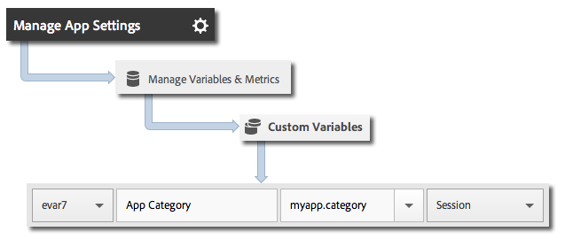

# Core implementation and lifecycle

This information helps you implement the Android library and collect lifecycle metrics, such as launches, upgrades, sessions, engaged users, and so on.

## Download the SDK

> **Important:** To download the SDK, you must use Android 2.2 or later.

1. Complete the steps in the following sections to set up a development report suite and download a pre-populated version of the configuration file:

    * [Create a Report Suite](/docs/android/getting-started/requirements.md) 
    * [Download the SDK](/docs/android/getting-started/requirements.md)

1. Download and unzip the `[Your_App_Name_]AdobeMobileLibrary-4.*-Android.zip` file and verify that the following software components exist:

    * `adobeMobileLibrary.jar`, which is the library that will be used with Android devices and simulators. 

    * `ADBMobileConfig.json`, which is the SDK configuration file that is customized for your app.

    > **Important:** If you download the SDK outside the Adobe Mobile services UI, the `ADBMobileConfig.json` file must be manually configured. If you are new to Analytics and the Mobile SDK, and you want to set up a development report suite and download a pre-populated version of the configuration file, see [Before You Start](/docs/android/getting-started/requirements.md).

## Add the SDK and config file to your IntelliJ IDEA or Eclipse project

**IntelliJ IDEA project**

To add the SDK and config file to your project:

1. Add the `ADBMobileConfig.json` file to the `assets` folder in your project. 

1. Right click your project in the project navigation panel. 
1. Select **Open Module Settings**. 
1. Under **Project Settings**, select **Libraries**. 
1. Click the **+** icon to add a new library. 
1. Select **Java** and navigate to the `adobeMobileLibrary.jar` file. 
1. Select the modules where you plan to use the mobile library. 
1. Click **Apply** and **OK** to close the Module Settings window.

**Eclipse project**

To add the SDK and config file to your project:

1. Add the `ADBMobileConfig.json` file to the `assets` folder in your project. 
1. In **Eclipse IDE**, right-click the project name. 
1. Click  **Build Path** > **Add External Archives**. 
1. Select `adobeMobileLibrary.jar`. 
1. Click **Open**. 
1. Right-click the project again and select **Build Path** > **Configure Build Path**. 
1. On the **Order and Export** tab, ensure that **`adobeMobileLibrary.jar`** is selected.

## Add app permissions

The AppMeasurement Library requires the following permissions to send data and record offline tracking calls:

* `INTERNET` 
* `ACCESS_NETWORK_STATE`

To add these permissions, add the following lines to your `AndroidManifest.xml` file, which is located in the application project directory:

```java
<uses-permission android:name="android.permission.INTERNET" /> 
<uses-permission android:name="android.permission.ACCESS_NETWORK_STATE" />
```

## Set the application context

The following code should be added in the `onCreate` method of your main activity:

```java
   @Override
   public void onCreate(BundlesavedInstanceState){
     super.onCreate(savedInstanceState)
     setContentView(R.layout.main);
     Config.setContext(this.getApplicationContext());
   }
```

## Implement lifecycle metrics

After you enable lifecycle, each time your app is launched, one hit is sent to measure launches, upgrades, sessions, engaged users, and many other metrics. For more information, see [Lifecycle Metrics](/docs/android/metrics.md).

**Complete the following steps in each activity of your application:**

1. Import the library: 

   ```java
   import com.adobe.mobile.*;
   ```

1. In the `onResume` function, start the lifecycle data collection: 

   ```java
   @Override 
   public void onResume() { 
       Config.collectLifecycleData(this); 
       // -or- Config.collectLifecycleData(this, contextData); 
   }
   ```

1. In the `onPause` function, pause the lifecycle data collection: 

   ```java
   @Override 
   public void onPause() { 
       Config.pauseCollectingLifecycleData(); 
   }
   ```

> **Important:** You must add these calls to every activity to ensure accurate crash reporting. For more information, see [Track App Crashes](/docs/android/analytics-main/crashes.md).

## Include additional data with lifecycle calls

To include additional data with lifecycle metric calls, pass an additional parameter to `collectLifecycleData` that contains context data:

```java
@Override 
public void onResume() {
    HashMap<String, Object> contextData = new HashMap<String, Object>(); 
    contextData.put("myapp.category", "Game"); 
    Config.collectLifecycleData(this, contextData); 
}
```

Additional context data values that are sent with `collectLifecycleData` must be mapped to custom variables in Adobe Mobile services: 



Other lifecycle metrics are collected automatically. For more information, see [Lifecycle Metrics](/docs/android/metrics.md).

## What to do next

Complete the following tasks:

* [Track App States](/docs/android/analytics-main/states.md) 
* [Track App Actions](/docs/android/analytics-main/actions.md)
