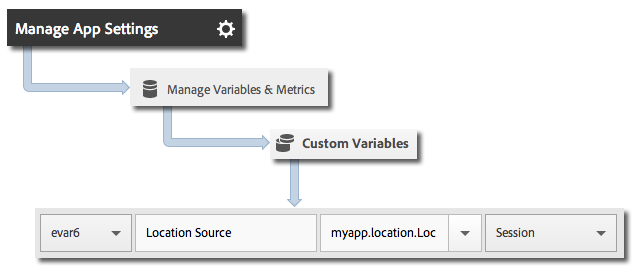

# Geo-location and points of interest

Geo-location helps you measure location data by using latitude and longitude and predefined points of interest in your Android apps.

Each `trackLocation` call sends the following information:

* Latitude, longitude, and location in a point of interest (POI) that is defined in the Adobe Mobile Services UI.

  This information is passed to mobile solution variables for automatic reporting. 

* Distance from center and accuracy passed as context data.

  These variables are not captured automatically. You must map these context data variables by using the instructions in the *Sending Additional Data* section below.

## Dynamic POI updates

Starting in version 4.2, POIs are defined in the Adobe Mobile UI and dynamically synchronized to the app configuration file. This synchronization requires an `analytics.poi` setting in the [ADBMobile JSON Config](/docs/android/configuration/json-config/json-config.md):

```js
"analytics.poi": "https://assets.adobedtm.com/…/yourfile.json",
```

If this is not configured, you must download an updated version of the `ADBMobile.json` file and add it to your app. For more information, see [Download the SDK and Testing Tools](/docs/android/getting-started/requirements.md).

## Tracking geo-location and POIs

1. Add the library to your project and implement lifecycle.

   For more information, see *Add the SDK and Config File to your IntelliJ IDEA or Eclipse Project* in [Core implementation and lifecycle](/docs/android/getting-started/dev-qs.md). 

1. Import the library: 

   ```java
   import com.adobe.mobile.*;
   ```

1. Call `trackLocation` to track the current location: 

   ```java
   Location currentLocation = new Location("my location here"); 
   Analytics.trackLocation(currentLocation, null);
   ```

   > **Tip:** You can call `trackLocation` at any time.

   You can use location strategies to determine the location that is passed to the `trackLocation` call. For more information, see [Android Location Strategies](https://developer.android.com/guide/topics/location/strategies.html).

Additionally, if the location is determined to be in a defined POI radius, an `a.loc.poi` context data variable is sent in with the `trackLocation` hit and is reported as a POI on the **Location Breakdown** reports. An `a.loc.dist` context variable is also sent with the distance in meters from the defined coordinates.

## Sending additional data

In addition to the location data, you can send additional context data with each track location call:

```java
HashMap<String, Object> locationContextData = new HashMap<String, Object>(); 
locationContextData.put("myapp.location.LocationSource", "GPS"); 
 
Location currentLocation = new Location("my location here"); 
Analytics.trackLocation(currentLocation, locationContextData);
```

Context data values must be mapped to custom variables in the Adobe Mobile Services UI: 



## Location context data

The latitude and longitude are sent by using three different context data parameters, with each parameter representing a different level of precision, for a total of six context data parameters.

For example, the coordinates lat = 40.93231, long = -111.93152 represent a location with 1 m precision. This location is split according to the level of precision across the following variables:

`a.loc.lat.a`= 040.9

`a.loc.lat.b` = 32

`a.loc.lat.c` = 31

`a.loc.lon.a` = -111.9

`a.loc.lon.b` = 31

`a.loc.lon.c` = 52

Some precision levels might appear as `00` depending on the accuracy of the current location. For example, if the location is currently accurate to 100m, `a.loc.lat.c` and `a.loc.lon.c` will be populated with `00`.

Remember the following information:

* A `trackLocation` request sends in the equivalent of a `trackAction` call. 

* POIs are not passed as part of typical `trackAction` and `trackState` calls, so you must use a `trackLocation` call to track POIs. 

* `trackLocation` should be called as often as necessary to track location and POIs.

  We recommend calling `trackLocation` when the app starts and then as needed, depending on the app's requirements. 

* POIs are populated only after they are defined in the app's configuration file.

  The POIs are not applied to historical `trackLocation` calls that were previously sent. 
* `trackLocation` calls support sending additional context data similar to `trackAction` calls. 

* When two POIs have overlapping diameters, the first POI that contains the current location is used.

  If your POIs overlap, you should list POIs in order of most to least granular to ensure that the most granular POI is reported.
