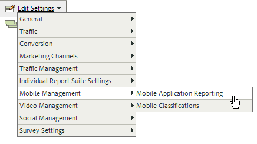
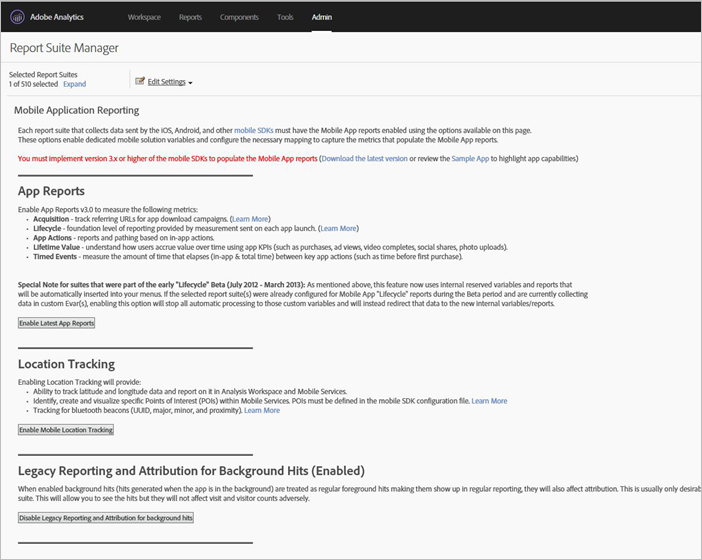

# Analytics

After you add the library to your project, you can make any of the Analytics method calls anywhere in your App (make sure you import ADBMobile.h to your class).

## Enable mobile application reports in Analytics

Before you add code, have your Analytics Administrator complete the following to enable Mobile App Lifecycle tracking. These actions ensure that your report suite is ready to capture metrics as you begin development.

1. Open **Admin Tools** > **Report Suites** and select your mobile report suite(s).
1. Click **Edit Settings** > **Mobile Management** > **Mobile Application Reporting**.

   

1. Click **Enable Latest App Reports**.

   Optionally, you can also click **Enable Mobile Location Tracking** and **Enable Legacy Reporting and Attribution for background hits**.

   

Lifecycle metrics are now ready to be captured, and Mobile Application Reports appear in the **Reports** menu in the marketing reports interface.

## Collect lifecycle metrics

1. To collect lifecycle metrics in your app, call `collectLifecycleData()` in the `ApplicationUI` constructor.

   For example:

   ```java
   ApplicationUI::ApplicationUI(bb::cascades::Application *app): QObject(app) { 
   //... 
   ADBMobile::collectLifecycleData(); 
   } 
   ```

   If `collectLifecycleData()` is called twice in the same session, then your application will report a crash on every call after the first. The SDK sets a flag when the application is shutdown that indicates a successful exit. If this flag is not set, `collectLifecyleData()` reports a crash.

## Events, props, and eVars

If you've looked at the [ADBMobile Class and Method Reference](/docs/blackberry/methods.md), you are probably wondering where to set events, eVars, props, heirs, and lists. In version 4, you can no longer assign those types of variables directly in your app. Instead, the SDK uses context data and processing rules to map your app data to Analytics variables for reporting.

Processing rules provide you several advantages:

* You can change your data mapping without submitting an update to the App Store.
* You can use meaningful names for data instead of setting variables that are specific to a report suite.
* There is little impact to sending in extra data. These values won’t appear in reports until they are mapped using processing rules.

Any values that you were assigning directly to variables should be added to the `data` HashMap instead.

## Processing rules

Processing rules are used to copy the data you send in context data variables to eVars, props, and other variables for reporting.

[Processing Rules](https://experienceleague.adobe.com/docs/analytics/admin/admin-tools/processing-rules/processing-rules.html)

Adobe recommends grouping your context data variables using "namespaces", as it helps you keep logical ordering. For example, if you want to collect info about a product, you might define the following variables:

```js
"product.type":"hat";
"product.team":"mariners";
"product.color":"blue";
```

Context data variables are sorted alphabetically in the processing rules interface, so namespaces let you quickly see variables that are in the same namespace.

Also, we have heard that some of you are naming context data keys using the eVar or prop number:

```js
"eVar1":"jimbo";
```

This might make it *slightly* easier when you perform the one time mapping in processing rules, but you lose readability during debugging and future code updates can be more difficult. Instead, we strongly recommend using descriptive names for keys and values:

```js
"username":"jimbo";
```

Context variables that define counter events can have the same key and value:

```js
"logon":"logon";
```

Context data variables that define incrementor events can have the event as the key and the amount to increment as the value:

```js
"levels completed":"6";
```

> **Tip:** Adobe reserves the namespace `a.`. Aside from that small restriction, context data variables just need to be unique in your login company to avoid collisions.

## Enable offline tracking

To store hits when the device is offline, you can optionally enable offline tracking in the `ADBMobileConfig.json` file.

Pay very close attention to the timestamp requirements described in the config file reference before you enable offline tracking.

## Analytics methods

For a list of the Analytics methods that are available for BlackBerry, see *Analytics methods* in [Adobe Mobile Class and Method Reference](/docs/blackberry/methods.md).
