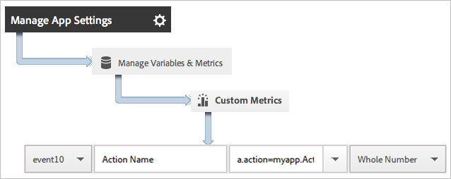
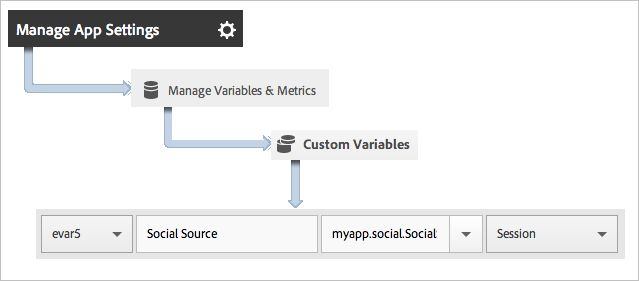

# Track app actions

Actions are the events that occur in your app that you want to measure. Each action has one or more corresponding metrics that are incremented each time the event occurs. For example, you might track a new subscription, each time an article is viewed or each time a level is completed. The corresponding metrics for these events are configured as subscriptions, articles read, and levels completed.

Actions are not tracked automatically, so to track an event, you must call `trackAction`.

## Tracking actions

1. Add the library to your project and implement lifecycle.

   For more information, see *Add the SDK and Config File to your Project* in [Core Implementation and Lifecycle](/docs/ios/getting-started/dev-qs.md). 
1. Import the library.

   ```objective-c
   #import "ADBMobile.h"
   ```

1. When the action that you want to track occurs in your app, call `trackAction` to send a hit for this action.

   ```objective-c
   [ADBMobile trackAction:@"myapp.ActionName"  
                     data:nil];
   ```

   > **Tip:** If the code where you are adding this call might run while the app is in the background, call `trackActionFromBackground` instead of `trackAction`.

1. In the Adobe Mobile services UI, select your app and click **Manage App Settings**. 

1. Click **Manage Variables and Metrics** and click the **Custom Metrics** tab. 

1. Map the context data name that is defined in your code, for example, `a.action=myapp.ActionName`, to a custom event.

   

You can also set a prop to hold all action values by mapping a custom prop with a name like **Custom Actions** and setting the value to `a.action`.


## Sending additional data

In addition to the action name, you can send additional context data with each track action call:

```objective-c
NSMutableDictionary *contextData = [NSMutableDictionary dictionary]; 
[contextData setObject:@"Twitter" forKey:@"myapp.social.SocialSource"]; 
[ADBMobile trackAction:@"myapp.SocialShare" data:contextData];
```

Context data values must be mapped to custom variables: 



## Tracking background actions

If you are tracking an action in code that might run when the app is in the background, call `trackActionFromBackground` instead of `trackAction`. Although `trackActionFromBackground` contains some additional logic to prevent lifecycle calls from firing when they should not, the parameters are the same.

## Action reporting

| Interface | Report |
|--- |--- |
|Adobe Mobile Services|**Action Paths** report. View the order in which actions occur in your app. You can also click **Customize** on any report to view actions ranked, trended, or in a breakdown report or apply a filter to view actions for a specific segment.|
|Marketing reports and analytics|**Custom Event** report.  After an action is mapped to a custom event, you can view mobile events similar to all other Analytics events.|
|Ad hoc analytics|**Custom Event** report. After an action is mapped to a custom event, you can view mobile events similar to all other Analytics events.|
