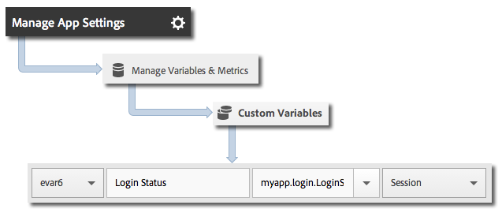

# Track app states

States are the different screens or views in your application. Each time a new state is displayed in your application, for example, when a user navigates from the home page to the news feed, a track state call should be sent. In iOS, a state is typically tracked in the viewDidLoad method of each view.

> **Tip:** To track states, make a call to `trackState`. States are not automatically tracked.

## Tracking states

1. Add the library to your project and implement lifecycle.

    For more information, see *Add the SDK and Config File to your Project* in [Core Implementation and Lifecycle](/docs/ios/getting-started/dev-qs.md). 
1. Import the library.

   ```objective-c
   #import "ADBMobile.h"
   ```

1. Call `trackState` to send a hit for this state view.

   ```objective-c
   [ADBMobile trackState:@"Login Screen"  
                    data:nil];
   ```

In Adobe Mobile services, the **State Name** is reported in the *`View State`* variable, and a view is recorded for each `trackState` call. In other Analytics interfaces, **View State** is reported as **Page Name**, and state views is reported as page views.

## Sending additional data

In addition to the **State Name**, you can send additional context data with each track action call:

```objective-c
NSMutableDictionary *contextData = [NSMutableDictionary dictionary]; 
[contextData setObject:@"logged in" forKey:@"myapp.login.LoginStatus"]; 
[ADBMobile trackState:@"Home Screen" data:contextData];
```

Context data values must be mapped to custom variables: 



## App state reporting

States are typically viewed by using a pathing report so you can see how users navigate your app and which states are viewed most.

| | |
|--- |--- |
|Adobe Mobile Services | The **View States** report. This report is based on the paths that the users took through your application. A sample path is  **Home**  >  **Settings**  > **Feed**. |
|Adobe Analytics|States can be viewed anywhere that Pages can be viewed, such as the **Pages** report, the **Page Views** report, and the **Path** report. |
|Ad hoc analytics|States can be viewed anywhere Pages can be viewed by using the **Page** dimension, **Page Views** metric, **Path** reports. |
