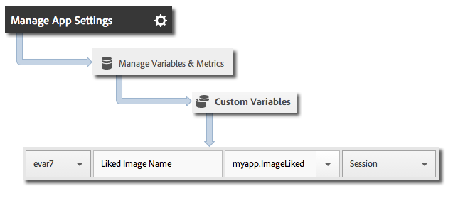

# Timed actions

Timed actions allow you to measure the in-app time and total time between the start and the end of an action. The SDK calculates the amount of time in each session and the total time across-sessions that it will take for the action to be completed. You can use timed actions to define segments and compare time to purchase, pass level, checkout flow, and so on.

The following metrics are reported for timed actions:

* Total # of seconds in app between start and end - cross sessions 
* Total # of seconds between start and end (clock time)

An optional callback allows you to take additional action when the timed action completes:

* Run code and add any logic - optional custom logic based on duration results. 
* Add context data prior to passing in durations. 
* Cancel hit and durations not yet sent.

## Tracking timed actions

1. Add the library to your project and implement lifecycle.

   For more information, see *Add the SDK and Config File to your Project* in [Core Implementation and Lifecycle](/docs/ios/getting-started/dev-qs.md). 
1. Import the library:

   ```objective-c
   #import "ADBMobile.h"
   ```

1. Call `trackTimedActionStart` and provide a timed action name and optional context data.

   ```objective-c
   [ADBMobile trackTimedActionStart:@"TimeUntilPurchase"  
                               data:@{@"ExperienceName" : experience}];
   ```

1. (Optional) To add additional context data at any time, you can call `trackTimedActionUpdate` with the timed action name.

   ```objective-c
   [ADBMobile trackTimedActionUpdate:@"TimeUntilPurchase"  
                                data:@{@"myapp.ImageLiked" : imageName}];
   ```

1. When the event completes, call `trackTimedActionEnd` and pass the timed action name and `TimedActionBlock` (callback), which will look up all data and calculate durations.

   Timed event metrics are saved in mobile solution variables for automatic reporting. 

   ```objective-c
   [ADBMobile trackTimedActionEnd:@"TimeUntilPurchase"  
                            logic:nil];
   ```

## Sending additional data

In addition to the timed action name, you can send additional context data with the action start and action update calls: 

```objective-c
[ADBMobile trackTimedActionUpdate:@"TimeUntilPurchase"  
                             data:@{@"myapp.ImageLiked" : imageName}];
```

Context data values must be mapped to custom variables: 



## Example

```objective-c
// Timed Action Start Example 
[ADBMobile trackTimedActionStart:@"TimeUntilPurchase"  
                            data:@{@"ExperienceName" : experience}];

// Timed Action Update Example 
[ADBMobile trackTimedActionUpdate:@"TimeUntilPurchase"  
                             data:@{@"ImageLiked" : imageName}];

// Timed Action End Example 
[ADBMobile trackTimedActionEnd:@"TimeUntilPurchase"  
                         logic:nil]; 
 
// Timed Action End Example with Callback 
[ADBMobile trackTimedActionEnd:@"TimeUntilPurchase"  
                         logic:^BOOL(NSTimeInterval inAppDuration,  
                                     NSTimeInterval totalDuration,  
                                     NSMutableDictionary *data) { 
                                        [data setObject:@"PurchaseItem" forKey:@"Item453"]; 
                                        return YES; //return YES to send the hit, NO to cancel 
                                     }];
```
