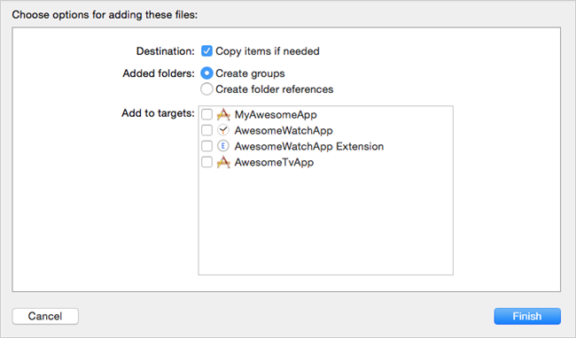
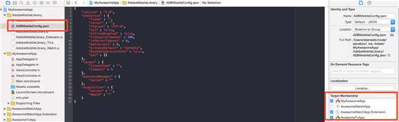
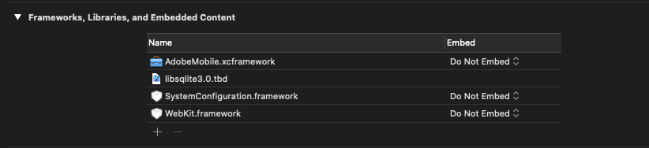
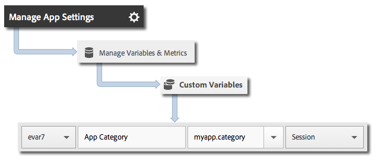

# Core implementation and lifecycle

This information helps you implement the iOS library and collect lifecycle metrics, such as launches, upgrades, sessions, engaged users, and so on.

## Download the SDK

> **Important:** The SDK requires iOS 8 or newer.

**Prerequisite**

Before you download the SDK, complete the steps in *Create a Report Suite* in [Core implementation and lifecycle](/docs/ios/getting-started/requirements.md) to set up a development report suite and download a pre-populated version of the configuration file.

To download the SDK:

> **Important:** Starting with version 4.21.0, the SDK is distributed via XCFrameworks. If using 4.21.0 or newer, follow the steps below.
>
>Version 4.21.0 of the SDK requires Xcode 12.0 or newer and, if applicable, Cocoapods 1.10.0 or newer.

1. Download, unzip the `[Your_App_Name_]AdobeMobileLibrary-4.*-iOS.zip` file and verify that you have the following software components in the `AdobeMobileLibrary` directory:

    * `ADBMobile.h` - the Objective-C header file used for iOS SDK.
    * `ADBMobileConfig.json` - the SDK configuration file that is customized for your app.
    * `AdobeMobile.xcframework` - contains two fat binaries, one each for iOS devices (armv7, armv7s, arm64) and simulators (i386, x86_64, arm64).

      This XCFramework should be linked when targeting an iOS app.

    * `AdobeMobileExtension.xcframework` - contains two fat binaries, one each for iOS devices (armv7, armv7s, arm64) and simulators (i386, x86_64, arm64).

      This XCFramework should be linked when targeting an iOS extension.

    * `AdobeMobileWatch.xcframework` - contains two fat binaries, one each for watchOS devices (arm64_32, armv7k) and simulators (i386, x86_64, arm64).

      This XCFramework should be linked when targeting an Apple Watch (watchOS) app.

    * `AdobeMobileTV.xcframework` - contains two fat binaries, one each for tvOS devices (arm64) and simulators (x86_64, arm64). 

      This XCFramework should be linked when targeting an Apple TV (tvOS) app.

> **Important:** In versions older than 4.21.0, the SDK is distributed via binaries. If using a version older than 4.21.0, follow the steps below.

1. Download, unzip the `[Your_App_Name_]AdobeMobileLibrary-4.*-iOS.zip` file and verify that you have the following software components:

    * `ADBMobile.h`, the Objective-C header file that is used for iOS AppMeasurement.
    * `ADBMobileConfig.json`, which is the SDK configuration file that is customized for your app.
    * `AdobeMobileLibrary.a`, a bitcode-enabled fat binary that contains the library builds for iOS devices (armv7, armv7s, arm64), and simulators (i386, x86_64).

      This fat binary should be linked when the target is intended for an iOS app.

    * `AdobeMobileLibrary_Extension.a`, a bitcode-enabled fat binary that contains the library builds for iOS devices (armv7, armv7s, arm64) and simulators (i386, x86_64).

      This fat binary should be linked when the target is intended for an iOS extension.

    * `AdobeMobileLibrary_Watch.a`, a bitcode-enabled fat binary that contains the library builds for Apple Watch devices (armv7k) and simulators (i386, x86_64).

      This fat binary should be linked when the target is intended for an Apple Watch (watchOS 2) extension app.

    * `AdobeMobileLibrary_TV.a`, a bitcode-enabled fat binary that contains the library builds for new Apple TV devices (arm64) and simulator (x86_64).

      This fat binary should be linked when target is intended for an Apple TV (tvOS) app.

> **Important:** If you download the SDK outside the Adobe Mobile services UI, the `ADBMobileConfig.json` file must be manually configured. If you are new to Analytics and the Mobile SDK, see [Before You Start](/docs/ios/getting-started/requirements.md) to set up a development report suite and download a pre-populated version of the configuration file.

## Add the SDK and config file to your project

1. Launch the Xcode IDE and open your app.
1. In Project Navigator, drag the `AdobeMobileLibrary` folder and drop it under your project.
1. Verify the following:

    * The **Copy Items if needed** checkbox is selected.
    * **Create groups** is selected.
    * None of the checkboxes in the **Add to targets** section is selected.

     

1. Click **Finish**.
1. In **Project Navigator**, select **`ADBMobileConfig.json`**.
1. In **File Inspector**, add the JSON file to any targets in your project that will use the Adobe SDK.

   

1. In **Project Navigator**, complete the following steps:

    1. Click on your app.
    1. On the **General** tab, select your targets and link the required frameworks and libraries in the **Linked Frameworks** and **Libraries** sections.

      * **iOS App Targets**
        * `SystemConfiguration.framework`
        * `WebKit.framework`
        * `libsqlite3.0.tbd`
        * `AdobeMobileLibrary.a`
        * `CoreLocation.framework` (optional, but required for geo-tracking capabilities)

      * **iOS Extension Target**

        * `SystemConfiguration.framework`
        * `libsqlite3.0.tbd`
        * `AdobeMobileLibrary\_Extension.a`

      * **Apple Watch (watchOS 2) Target**

        * `libsqlite3.0.tbd`
        * `AdobeMobileLibrary\_Watch.a`

      * **Apple TV (tvOS) Target**

          * `SystemConfiguration.framework`
          * `libsqlite3.0.tbd`
          * `AdobeMobileLibrary\_TV.a`


    > **Caution:**  Linking more than one `AdobeMobileLibrary*.a` file in the same target will result in unexpected behavior or the inability to build.

    > **Important:**  If using version 4.21.0 or newer, ensure that the Adobe XCFrameworks are not embedded.

    

1. Confirm that your app builds without errors.

## Implement lifecycle metrics

> **Important:** iOS will send lifecycle information with or without calling `collectlifecycledata`, and `collectlifecycledata` is only a way to initiate lifecycle earlier in the application's launch sequence.

After you enable lifecycle, each time your app is launched, one hit is sent to measure launches, upgrades, sessions, engaged users, and other [Lifecycle Metrics](/docs/ios/metrics.md).

Add a `collectLifecycleData`/ `collectLifecycleDataWithAdditionalData` call in `application:didFinishLaunchingWithOptions`:

```objective-c
- (BOOL)application:(UIApplication *)application didFinishLaunchingWithOptions:(NSDictionary *)launchOptions {
 [ADBMobile collectLifecycleData];
    return YES;
}
```

### Include additional data with lifecycle calls

To include additional data with lifecycle metric calls, use `collectLifecycleDataWithAdditionalData`:

> **Important:** Any data that is passed to the SDK through `collectLifecycleDataWithAdditionalData:` is persisted in `NSUserDefaults` by the SDK. The SDK strips the values in the `NSDictionary` parameter that are not of the `NSString` or `NSNumber` types.

```objective-c
- (BOOL)application:(UIApplication *)application didFinishLaunchingWithOptions:(NSDictionary *)launchOptions {
    NSMutableDictionary *contextData = [NSMutableDictionary dictionary];
    [contextData setObject:@"Game" forKey:@"myapp.category"];
    [ADBMobile collectLifecycleDataWithAdditionalData:contextData];
    return YES;
}
```

Additional context data values that are sent with `collectLifecycleDataWithAdditionalData` must be mapped to custom variables in Adobe Mobile services:



Other lifecycle metrics are collected automatically. For more information, see [Lifecycle Metrics](/docs/ios/metrics.md).

## What to do next

Complete the following tasks:

* [Track App States](/docs/ios/analytics-main/states.md)
* [Track App Actions](/docs/ios/analytics-main/actions.md)
