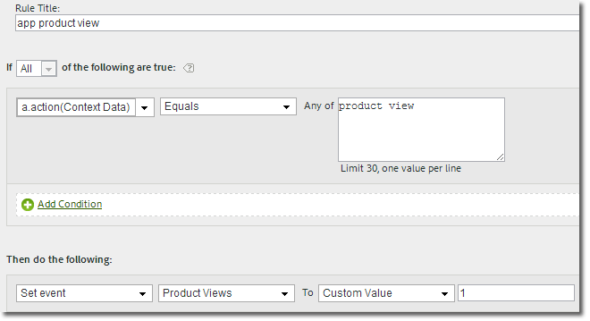

# Migrating to the 4.x iOS library

This information helps you migrate from the versions 3.x or 2.x of the iOS library to version 4.x.

> **Important:** The SDK uses `NSUserDefaults` to store data that is needed to calculate unique users, lifecycle metrics, and other data related to core SDK functionality.  If you modify or remove the values in `NSUserDefaults` that are expected by the SDK, unexpected behavior might result in the form of data inconsistencies.

In the version 4.x of the iOS SDK library, the public methods are consolidated into one header. Also, the functionality is now accessible through class level methods, so you do not have to keep track of pointers, instances, or singletons.

## Events, props, and eVars

In version 4, you can no longer assign variables such as events, eVars, props, heirs, and lists directly in your app. Instead, the SDK uses context data and processing rules to map your app data to Analytics variables for reporting.

Processing rules provide the following advantages:

* You can change your data mapping without submitting an update to the App Store. 
* You can use meaningful names for data instead of setting variables that are specific to a report suite. 
* There is little impact to sending in extra data.

  These values will not appear in reports until they are mapped using processing rules.

> **Tip:** Values that you were assigning directly to variables should now be added to the `data` NSDictionary.

## Remove unused properties

The new `ADBMobileConfig.json` file contains application-specific, global settings, and replaces most of the configuration variables that were used in previous versions. Here is an example of an `ADBMobileConfig.json` file:

```js
{ 
    "version" : "1.0", 
    "analytics" : { 
        "rsids" : "coolApp", 
        "server" : "my.CoolApp.com", 
        "charset" : "UTF-8", 
        "ssl" : true, 
        "offlineEnabled" : true, 
        "lifecycleTimeout" : 5, 
        "privacyDefault" : "optedin", 
        "poi" : [ 
                    ["san francisco",37.757144,-122.44812,7000], 
                    ["santa cruz",36.972935,-122.01725,600] 
                ] 
    }, 
 "target" : { 
  "clientCode" : "myTargetClientCode", 
  "timeout" : 5 
 }, 
 "audienceManager" : { 
  "server" : "myServer.demdex.com" 
 } 
}
```


### Moving the configuration file

To move the configuration file:

1. Move the value that is set for the variable in the first column to the variable in the second column. 
1. Remove the old configuration variable from your code.

### Migration information

The following tables list the configuration variables that you need to move to the configuration file.

#### Migrating from version 3.x

Move the value from the first column to the variable in the second column. 

| Configuration Variable | Variable in the `ADBMobileConfig.json` file |
|--- |--- |
|offlineTrackingEnabled|"offlineEnabled"|
|offlineHitLimit|"batchLimit"|
|reportSuiteIDs|"rsids"|
|trackingServer|"server"|
|charSet|"charset"|
|currencyCode|"currency"|
|ssl|"ssl"|
|linkTrackVars|Remove, no longer used.|
|linkTrackEvents|Remove, no longer used.|


#### Migrating from version 2.x

Move the value from the first column to the variable in the second column. 

| Configuration Variable | Variable in the `ADBMobileConfig.json` file |
|--- |--- |
|trackOffline|"offlineEnabled"|
|offlineLimit|"batchLimit"|
|account|"rsids"|
|trackingServer|"server", remove the `"https://"` prefix. The protocol prefix is added automatically based on the "ssl" setting.|
|trackingServerSecure|Remove. For secure connections, define "server" and then enable "ssl".|
|charSet|"charset"|
|currencyCode|"currency"|
|ssl|"ssl"|
|linkTrackVars|Remove, no longer used.|
|linkTrackEvents|Remove, no longer used.|
|timestamp|Remove, no longer configurable.|
|dc|Remove, no longer used.|
|userAgent|Remove, no longer configurable.|
|dynamicVariablePrefix|Remove, no longer used.|
|visitorNamespace|Remove, no longer used.|
|usePlugins|Remove, no longer used.|
|useBestPractices  all calls to churn measurement (  getChurnInstance )|Remove, replaced by lifecycle metrics. For more information, see [Lifecycle Metrics](/docs/ios/metrics.md).|


## Update track calls and tracking variables

Instead of using the web-focused `track` and `trackLink` calls, the version 4 SDK uses the following methods:

* `trackState:data:` states are the views that are available in your app, such as `home dashboard`, `app settings`, `cart`, and so on.

  These states are similar to pages on a website, and `trackState` calls increment page views. 

* `trackAction:data:` actions , such as `logons`, `banner taps`, `feed subscriptions`, and other metrics that occur in your app and that you want to measure.

The `data` parameter for both of these methods is an `NSDictionary` that contains name-value pairs that are sent as context data.

### Events, props, eVars

In version 4, you can no longer assign variables such as events, eVars, props, heirs, and lists directly in your app. The SDK now uses context data and processing rules to map your app data to Analytics variables for reporting.

Processing rules provide the following advantages:

* You can change your data mapping without submitting an update to the App Store. 
* You can use meaningful names for data instead of setting variables that are specific to a report suite. 
* There is little impact to sending in extra data.

  These values will not appear in reports until they are mapped by using processing rules. For more information, see [Processing Rules and Context Data](/docs/ios/getting-started/proc-rules.md).

Values that you assigned directly to variables should be added to the `data` `NSDictionary` instead. This means that calls to `setProp`, `setEvar`, and assignments to persistent context data should all be removed and the values be added to the `data` parameter.

### AppSection/Server, GeoZip, transaction ID, Campaign, and other standard variables

Data that you were setting on the measurement object, including the variables listed above, should be added to the `data` `NSDictionary` instead. The only data that is sent with a `trackState` or `trackAction` call is the payload in the `data` parameter.

### Replace tracking calls

In your code, replace the following methods with a call to `trackState` or `trackAction`:

#### Migrating from version 3.x

* `trackAppState (trackState)` 
* `trackEvents (trackAction)` 
* `track (trackAction)` 
* `trackWithContextData (trackAction)` 
* `trackLinkURL (trackAction)`

#### Migrating from version 2.x

* `track (trackState)` 
* `trackLink (trackAction)`

## Custom visitor ID

Replace the `visitorID` variable with a call to `setUserIdentifier:`.

## Offline tracking

Offline tracking is enabled in the `ADBMobileConfig.json` file, and all other offline configuration is done automatically.

In your code, remove calls to the following methods:

### Version 3.x

* `setOnline` 
* `setOffline`

### Version 2.x

* `forceOffline` 
* `forceOnline`

## Products variable

Since the products variable is not available in processing rules, you can use the following syntax to set `products`:

```objective-c
//create a processing rule to set the corresponding product event. 
// for example, set prodView event when context data a.action = "product view" 
[ADBMobile trackAction:@"LikeButtonClicked"  
                  data:@{@"&&products" : @";Cool Shoe"}];
```


