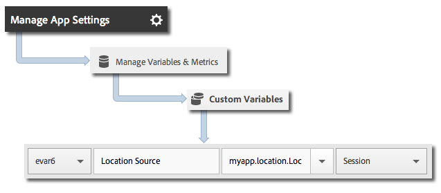

# Geo-location and points of interest

Geo-location helps you measure location data by using latitude and longitude and predefined points of interest in your iOS apps.

Each `trackLocation` call sends the following:

* Latitude, longitude, and location in a point of interest (POI) that is defined in Adobe Mobile services.

  This information is passed to mobile solution variables for automatic reporting. 

* Distance from center and accuracy passed as context data.

  These variables are not captured automatically. You must map these context data variables by using the instructions in *Sending Additional Data* section below.

## Dynamic POI updates

Starting in version 4.2, POIs are defined in the Adobe Mobile interface and synchronized dynamically to the app configuration file. This synchronization requires an `analytics.poi` setting in the `ADBMobile.json` file:

```js
"analytics.poi": "https://assets.adobedtm.com/…/yourfile.json",
```

For more information, see [ADBMobile JSON Config](/docs/ios/configuration/json-config/json-config.md).

If this is not configured, an updated version of the `ADBMobile.json` file must be downloaded and added to your app. For more information and instructions, see *Download the SDK and Testing Tools* in [Before you Start](/docs/ios/getting-started/requirements.md).

## Track geo-locations and POIs

1. Add the library to your project and implement lifecycle.

    For more information, see *Add the SDK and Config File to your Project* in [Core Implementation and Lifecycle](/docs/ios/getting-started/dev-qs.md). 
1. Import the library: 

   ```objective-c
   #import "ADBMobile.h"
   ```

1. Call `trackLocation` to track the current location: 

   ```objective-c
   CLLocation *currentLocation = location; 
   [ADBMobile trackLocation: currentLocation data: nil]; 
   ```

   > **Tip:** You can call `trackLocation` at any time.

   To determine the location that is passed to the `trackLocation` call, use [Getting the User’s Location](https://developer.apple.com/Library/ios/documentation/UserExperience/Conceptual/LocationAwarenessPG/CoreLocation/CoreLocation.html).

Additionally, if the location is determined to be in a defined POI radius, an `a.loc.poi` context data variable is sent in with the `trackLocation` hit and is reported as a POI in Location reports. An `a.loc.dist` context variable is also sent with the distance in meters from the defined coordinates.

## Send additional data

In addition to the location data, you can send additional context data with each track location call:

```objective-c
NSMutableDictionary *contextData = [NSMutableDictionary dictionary]; 
[contextData setObject:@"GPS" forKey:@"myapp.location.LocationSource"]; 
[ADBMobile trackLocation: currentLocation data:contextData];
```

Context data values must be mapped to custom variables: 



## Location context data

The latitude and longitude are each sent using three different context data parameters, with each parameter representing a different level of precision, for a total of six context data parameters.

For example, the coordinates lat = 40.93231, lon = -111.93152 represent a location with 1 m precision. This location is split according to the level of precision across the following variables:

* `a.loc.lat.a`= 040.9
* `a.loc.lat.b` = 32
* `a.loc.lat.c` = 31
* `a.loc.lon.a` = -111.9
* `a.loc.lon.b` = 31
* `a.loc.lon.c` = 52

Some precision levels might appear as "00" depending on the accuracy of the current location. For example, if the location is currently accurate to 100m, `a.loc.lat.c` and `a.loc.lon.c` will be populated with "00".

## Additional information

Remember the following information:

* A `trackLocation` request sends in the equivalent of a `trackAction` call. 

* POIs are not passed as part of normal `trackAction` and `trackState` calls, so you must use a `trackLocation` call to track POIs. 

* `trackLocation` should be called as often as necessary to track location and POIs.

  We recommend calling `trackLocation` when the app starts and then as needed based on the requirements of the application. 

* POIs are populated only after they are defined in the app configuration file.

  They are not applied to historical `trackLocation` calls that were sent previously. 
* `trackLocation` calls support sending additional context data similar to `trackAction` calls. 

* When two POIs have overlapping diameters, the first POI that contains the current location is used. 

  If your POIs overlap, you should list POIs in order of most granular to least granular to ensure that the most granular POI is reported.
