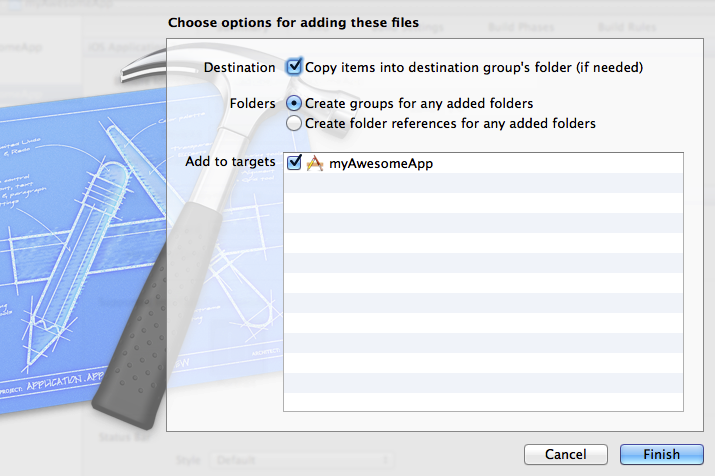

# PhoneGap plug-in

This plug-in lets you send iOS AppMeasurement calls from your PhoneGap project.

## New Adobe Experience Platform Mobile SDK Release

Looking for information and documentation related to the Adobe Experience Platform Mobile SDK? Click [here](https://aep-sdks.gitbook.io/docs/) for our latest documentation.

As of September 2018, we released a new, major version of the SDK. These new Adobe Experience Platform Mobile SDKs are configurable through [Experience Platform Launch](https://www.adobe.com/experience-platform/launch.html).

* To get started, go to Adobe Experience Platform Launch.
* To see what is in the Experience Platform SDK repositories, go to [Github: Adobe Experience Platform SDKs](https://github.com/Adobe-Marketing-Cloud/acp-sdks).


## Create a PhoneGap project

To create a PhoneGap project, see [PhoneGap](https://helpx.adobe.com/experience-manager/6-4/mobile/using/phonegap.html).

## Install the plug-in using npm:

1. Run the following command: 

   ```
   cordova plugin add adobe-mobile-services
   ```

## Manually install the plug-in

### Include the AppMeasurement library

To include the AppMeasurement:

1. Drag `ADBMobile_PhoneGap.h` and  `ADBMobile_PhoneGap.m` into the **Plugins** folder in your Xcode project. 
1. Complete the following settings:

    1. Select **Copy items into destination group's folder (if needed)**. 
    1. Select the targets where you want to use AppMeasurement code.

1. Drag `ADB_Helper.js` into the `www` folder in your project. 
1. In the `res/xml` folder, open `config.xml` and register an new plugin by adding the following: 

   ```
   <feature name="ADBMobile_PhoneGap"> 
     <param name="ios-package" value="ADBMobile_PhoneGap" /> 
   </feature>
   ```

### Add app permissions

The AppMeasurement library requires the following:

1. Launch the Xcode IDE and open your app. 
1. Drag the **AdobeMobile** folder into your Xcode project and complete the following settings:

    1. Select **Copy items into destination group's folder (if needed)**. 
    1. Select **Create groups for any added folders**. 
    1. Select the targets where you want to use AppMeasurement code and click **Finish**.

   {width="672"}

1. In the **Build Phases** tab of your project’s target, expand the **Link Binary with Libraries** section and add the following libraries:

    * `libsqlite3.dylib`
    * `SystemConfiguration.framework`

1. Confirm that your app builds without unexpected errors.

## Implement custom tracking

In `html` files where you want to use tracking, add the following to the `<head>` tag:

```html
<script type="text/javascript" charset="utf-8" src="ADB_Helper.js"></script>
```
