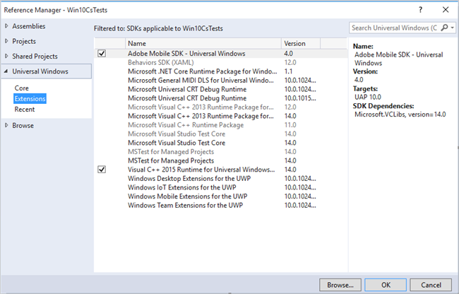

# Windows Visual Studio extensions for Experience Cloud Solutions 4.x SDK

This extension provides a much easier way to add the reference of the Experience Cloud Solutions 4.x Windows SDK in your project.

## Install the library from GitHub

1. Download the Windows Universal SDK from [GitHub](https://github.com/Adobe-Marketing-Cloud/mobile-services/releases). 
1. Unzip the downloaded file locally. 
1. Double-click the **ADBMobileUniversalWindowsVSIX.vsix** file to open the installer. 
1. Select **Global Location** and install the library.

## Add references to your project

1. Open your Windows 10 project. 
1. Open the Reference Manager dialogue box.

   

1. On the **Extensions** tab, locate and select **Adobe Mobile SDK**. 
1. Click **OK** to save it.

   The Adobe Mobile SDK will be added to your project. If the **Microsoft Visual C++ Runtime** package has not yet been added, this package will also be added to your project. 

1. In the Configuration Manager, select a a platform type and begin testing your app.
