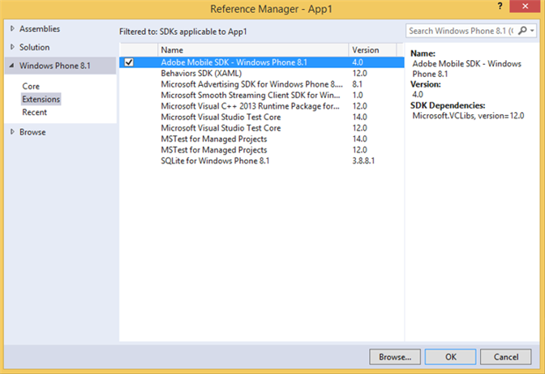

# Windows Visual Studio extensions for Experience Cloud Solutions 4.x SDK

This Extensions provides you a much easier way to add the reference of Experience Cloud Solutions 4.x Windows SDK in you project.

## Install the library from GitHub

1. Download the Windows Universal SDK from [GitHub](https://github.com/Adobe-Marketing-Cloud/mobile-services/releases). 
1. Unzip the downloaded file locally. 
1. Double-click the ADBMobileWindowsStoreVSIX.vsix or ADBMobileWindowsPhoneVSIX.vsix file to open the installer. 

1. Select **Global Location** and install the library.

## Add references to your project

1. Open your Windows 8.1 or Windows Phone 8.1 project. 
1. Open the Reference Manager dialogue box.

   

1. On the **Extensions** tab of Windows 8.1 or Windows Phone 8.1, locate and select **Adobe Mobile SDK**. 
1. Click **OK** to save it.

   The Adobe Mobile SDK will be added to your project, and if it has not already been added, the **Microsoft Visual C++ Runtime** package is also added. 

1. In the Configuration Manager, select a Platform type, and begin testing your app.
